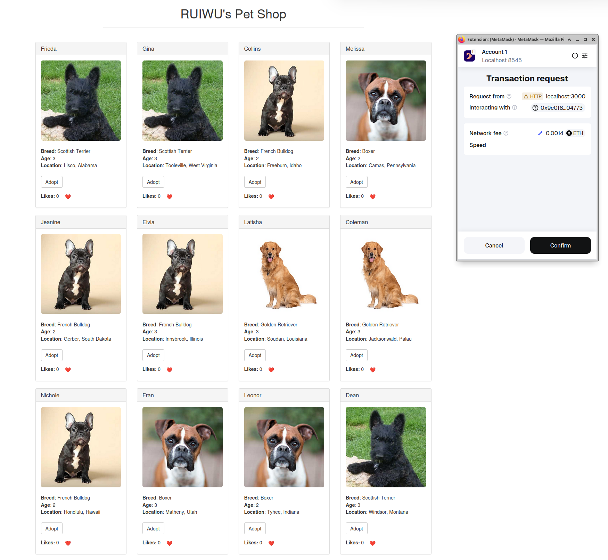

# APS1050 · Ethereum Pet Shop (Extended)

A production-like **full-stack dApp** that extends Truffle’s Pet Shop with **fee-gated pet registration (with photos), on-chain likes/voting, owner-only donation withdraw, per-user adoption history, and paid returns** — built and verified locally with **Ganache + MetaMask**.

<p align="center">
  
</p>

---

## Key Features

1. **Register Pet (with photo) and pay a fee**  
   Paid submission writes to chain only after success; newly registered pets appear with images.

2. **Like/Vote & “Most Famous” view**  
   Users can like a pet; the app aggregates and displays the most popular pet.

3. **Donate + Owner-only Withdraw**  
   Anyone can donate; only the shop owner can withdraw funds.

4. **Per-user Adoption History**  
   Track adoptions by the current address and render them in the UI.

5. **Return Pet (with fee)**  
   A paid return action completes the adoption lifecycle.

> The project delivers six major enhancements counting “register + photo + fee” as two items. All features are demonstrated via local transactions and screenshots.

---

## Tech Stack

- **Solidity** — core logic, state, and funds flow  
- **Truffle & Artifacts + Web3** — compile/migrate and front-end contract calls  
- **Ganache** — local blockchain (HTTP RPC e.g., `http://127.0.0.1:7545`)  
- **MetaMask** — account management & signing  
- **Node.js + lite-server** — static front end with live reload

---

## Architecture Overview

- **Contracts** (example: `PetShop.sol`):
  - Structs store pet metadata (name/breed/photo), fee/price, owner, like counters
  - `registerPet()` / `adopt()` / `returnPet()` emit events and enforce pricing/ownership
  - `likePet()` and a query to derive “most famous”
  - `donate()` for anyone and **`withdraw()` restricted to the owner**
- **Frontend**:
  - Uses Truffle artifacts + Web3.js to call the deployed contract
  - Event-driven UI refresh for likes, adoption history, most-famous, etc.

These map to a clear **feature → page → transaction** flow, from contract events to UI updates.

---

## Getting Started (Local)

### 0) Prereqs

```bash
node -v        # Node 18/20 recommended
npm -v
```

### 1) Clone & Install

```bash
git clone https://github.com/lglsj666/APS1050_ETH.git
cd APS1050_ETH
npm install        # or: npm ci
```

### 2) Compile & Migrate (Ganache running)

```bash
truffle compile
truffle migrate --reset
```

### 3) Run the UI

```bash
npm run dev        # if missing: npm i -D lite-server
```

### 4) MetaMask

- Network: your local Ganache (e.g., `http://127.0.0.1:8545`)
- Chain ID: the one shown in Ganache (typical local values are 1337/5777)
- Import a Ganache private key for testing

---

## Main Functions

- **Register** Register a new pet that can be adopted by others  
- **Like** Like a pet  
- **Most Famous** The pet with the most likes will be displayed as our famous pet  
- **Adopt / Return** Adopt/Return a pet. The records are shown in **your adoption history**  
- **Donate** Customers can donate to the shop
  **withdraw** Only shop owner can withdraw the donation

---

## Repo & Tutorial

- Source: <https://github.com/lglsj666/APS1050_ETH/tree/main>  
- Base guide used for scaffolding/learning path: Truffle Pet Shop — <https://archive.trufflesuite.com/guides/pet-shop/>

---

## License

For coursework and learning. If reusing, please keep attribution and the original tutorial reference.
